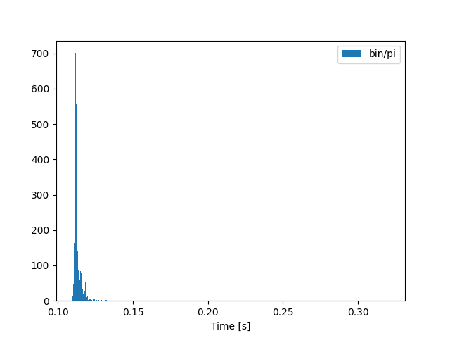
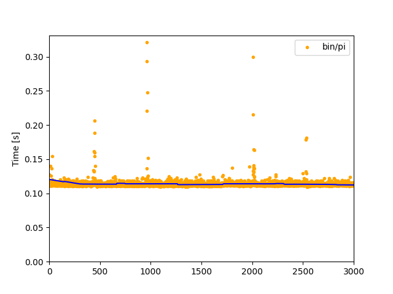
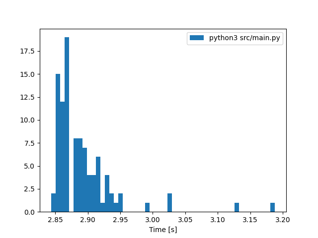
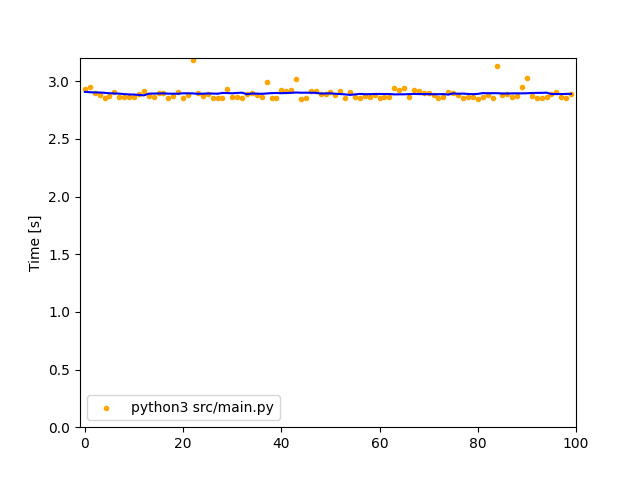

# MAC5742 - Programação Concorrente e Paralela (2022)

Para melhor visualização e acessar todos os arquivos, visite https://github.com/willrazen/mac5742 

### EP1

*Problema:* Calcular pi através do método de Monte Carlo em duas linguagens de programação, utilizando pseudo-código fornecido.

*Algoritmos implementados:*
- Go: [EP1/src/main.go](EP1/src/main.go)
- CPython: [EP1/src/main.py](EP1/src/main.py)

*Resultados:*
| Language | Runs | Mean ± Stddev [ms] | Min [ms] | Median [ms] | Max [ms]      |
|----------|------|--------------------|----------|-------------|---------------|
| Go       | 3000 | 114 ± 8            | 109      | 112         | 321           |
| CPython  | 100  | 2892 ± 52          | 2843     | 2879        | 3188          |

- Conforme o esperado, Go é ~25 vezes mais rápido
- Tempo de execução de cada programa foi de aproximadamente 5 minutos
- Outliers não foram removidos das estatísticas, porém nota-se oportunidades (ver gráficos no fim deste readme)
- Todos os data points e gráficos estão disponíveis em json [aqui](EP1/out/20220328033810) 

*Abordagem:*
- Ambiente escolhido foi Amazon EC2 t3.micro, com Amazon Linux 2, pela reprodutibilidade, isolamento e baixo custo (USD ~0.01/h)
- Mais informações sobre o ambiente podem ser encontradas [aqui](env_info.txt)
- Linguagens escolhidas foram Go 1.15.14 e CPython 3.7.10 (versões padrão do ambiente)
- Código elaborado com apenas standard lib de cada linguagem e seguindo pseudo-código, para uma comparação justa e idiomática
    - Também foi testada versão em CPython com gerador aleatório do Numpy, porém foi desconsiderada pela lentidão
- Mensuração de tempo realizada pelo [Hyperfine](https://github.com/sharkdp/hyperfine), ferramenta própria para benchmarking, trazendo maior confiança nos dados gerados
- Código em Go foi compilado de antemão, já em Python foi executado com interpretador (ver [aqui](EP1/run.sh))

*Gráficos:*
| Language | Histogram                               | Progression                             |
|----------|-----------------------------------------|-----------------------------------------|
| Go       |  |  |
| CPython  |  |  |
