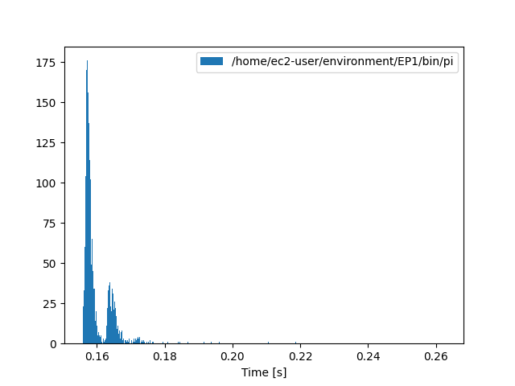
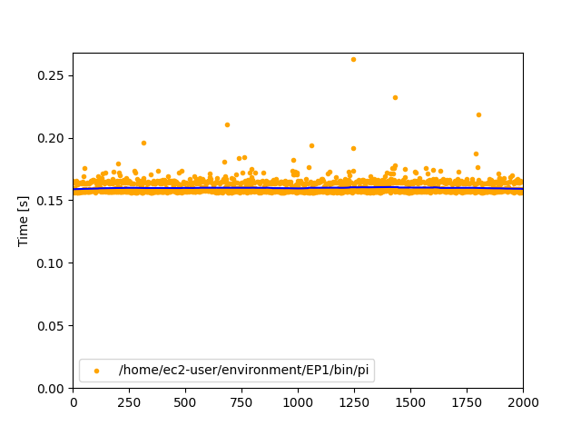
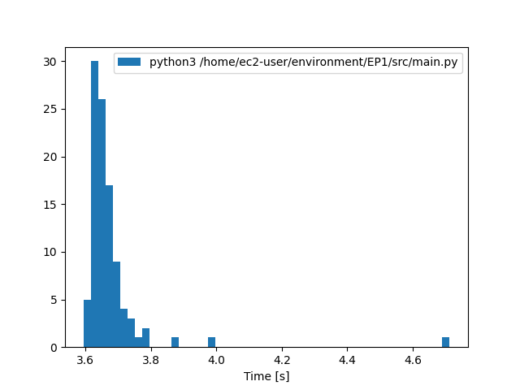
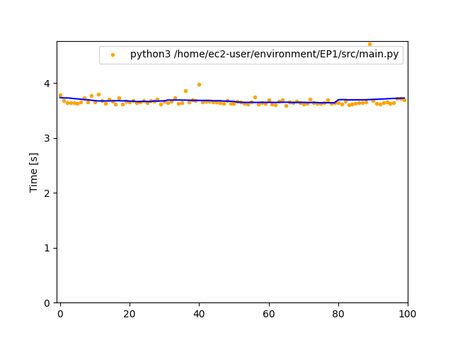

# MAC5742 - Programação Concorrente e Paralela (2022)

### EP1

*Problema:* Calcular pi através do método de Monte Carlo em duas linguagens de programação, utilizando pseudo-código fornecido.

*Abordagem:*
- Ambiente escolhido foi Amazon EC2 t2.micro (free tier), com Amazon Linux 2, pela reprodutibilidade e isolamento
- Linguagens escolhidas foram Go 1.15.14 e CPython 3.7.10 (versões são padrão do ambiente)
- Código elaborado com apenas standard lib de cada linguagem e seguindo pseudo-código, para uma comparação justa e idiomática
- Foi testada versão em CPython com gerador aleatório do Numpy, porém foi desconsiderada pela lentidão
- Código em Go foi compilado de antemão, já em Python foi executado com interpretador (ver [aqui](EP1/run.sh))
- Mensuração realizada pelo [Hyperfine](https://github.com/sharkdp/hyperfine), ferramenta própria para benchmarking, trazendo maior confiança nos dados gerados
- Execução de cada programa por pelo menos 5 minutos

*Resultados:*
| Language | Runs | Mean ± Stddev [ms] | Min [ms] | Median [ms] | Max [ms]      |
|----------|------|--------------------|----------|-------------|---------------|
| Go       | 2000 | 160 ± 5            | 156      | 158         | 263           |
| CPython  | 100  | 3673 ± 118         | 3593     | 3649        | 4713          |

Conforme o esperado, Go é ~23 vezes mais rápido.

*Gráficos:*
| Language | Histogram                | Progression              |
|----------|--------------------------|--------------------------|
| Go       |  |  |
| CPython  |  |  |
