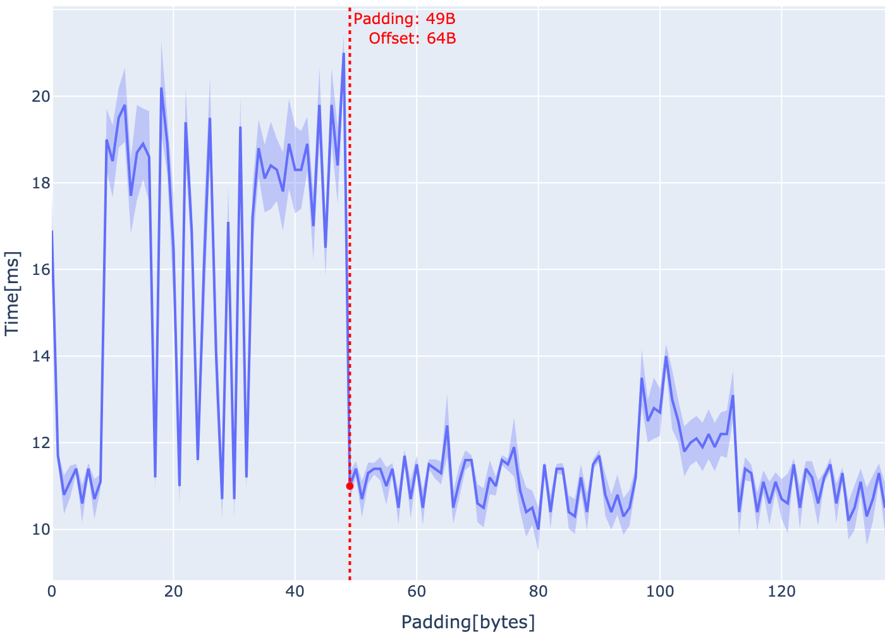

# MAC5742 - Programação Concorrente e Paralela (2022)

Para melhor visualização e acessar todos os arquivos, visite https://github.com/willrazen/mac5742 

## Índice
- [Mini EP1](#mini-ep1)
- [Mini EP2](#mini-ep2)
- [Mini EP3](#mini-ep3)
- [Mini EP4](#mini-ep4)
- [Mini EP5](#mini-ep5)
- [Mini EP6](#mini-ep6)

## Mini EP1

*Problema:* Calcular pi através do método de Monte Carlo em duas linguagens de programação, utilizando pseudo-código fornecido.

*Algoritmos implementados:*
- Go: [miniep1/src/main.go](miniep1/src/main.go)
- CPython: [miniep1/src/main.py](miniep1/src/main.py)

*Resultados:*
| Language | Runs | Mean ± Stddev [ms] | Min [ms] | Median [ms] | Max [ms]      |
|----------|------|--------------------|----------|-------------|---------------|
| Go       | 3000 | 114 ± 8            | 109      | 112         | 321           |
| CPython  | 100  | 2892 ± 52          | 2843     | 2879        | 3188          |

- Conforme o esperado, Go é ~25 vezes mais rápido
- Tempo de execução de cada programa foi de aproximadamente 5 minutos
- Outliers não foram removidos das estatísticas, porém nota-se oportunidades (ver gráficos no fim deste readme)
- Todos os data points e gráficos estão disponíveis em json [aqui](miniep1/out/20220328033810) 

*Abordagem:*
- Ambiente escolhido foi Amazon EC2 t3.micro, com Amazon Linux 2, pela reprodutibilidade, isolamento e baixo custo (USD ~0.01/h)
- Mais informações sobre o ambiente podem ser encontradas [aqui](miniep1/env_info.txt)
- Linguagens escolhidas foram Go 1.15.14 e CPython 3.7.10 (versões padrão do ambiente)
- Código elaborado com apenas standard lib de cada linguagem e seguindo pseudo-código, para uma comparação justa e idiomática
    - Também foi testada versão em CPython com gerador aleatório do Numpy, porém foi desconsiderada pela lentidão
- Mensuração de tempo realizada pelo [Hyperfine](https://github.com/sharkdp/hyperfine), ferramenta própria para benchmarking, trazendo maior confiança nos dados gerados
- Código em Go foi compilado de antemão, já em Python foi executado com interpretador (ver [aqui](miniep1/run.sh))

*Gráficos:*
| Language | Histogram                               | Progression                             |
|----------|-----------------------------------------|-----------------------------------------|
| Go       |  |  |
| CPython  |  |  |

## Mini EP2

*Problema:* Aprimorar abordagem elaborada no Mini EP1 para a linguagem mais rápida (no caso Go), mantendo a essência do algoritmo (monte carlo) e sem paralelizar.

*Algoritmos implementados:*
- Melhor performance: [miniep2/pi/best.go](miniep2/pi/best.go)
- Outros testes disponíveis em [miniep2/pi](miniep2/pi)

*Resultados:*
| Runs | Mean ± Stddev [ms] | Min [ms] | Median [ms] | Max [ms]      |
|------|--------------------|----------|-------------|---------------|
| 1000 | 44 ± 1             | 43       | 44          | 52            |

*Abordagem:*
- Através de profiling com ferramentas nativas `go test -bench` e `go tool pprof`, foi identificado que ~72% do tempo foi gasto com a geração de números aleatórios (ver [call-graph](https://raw.githubusercontent.com/willrazen/mac5742/main/miniep2/out/20220404051435/cpu_graph.svg) e [flame-graph](http://htmlpreview.github.io/?https://github.com/willrazen/mac5742/blob/main/miniep2/out/20220404051435/cpu_flame.html))
- O módulo nativo `math/rand` já é especialmente [rápido](https://github.com/lukechampine/frand#benchmarks) para 1 thread, porém [outros algoritmos](https://qqq.ninja/blog/post/fast-threadsafe-randomness-in-go/) podem ser ainda mais rápidos
- Utilizando [github.com/vpxyz/xorshift](https://github.com/vpxyz/xorshift) foi possível [reduzir ~61%](miniep2/out/20220404051435/stats.txt) do tempo de processamento
  - Para discussão sobre o algoritmo ver [aqui](https://prng.di.unimi.it/)
- Outras otimizações implementadas com pequenos ganhos (~2%) foram:
  - Unroll de iterações
  - Compilação com static-linking
- No algoritmo vencedor foram combinados [splitmix.go](miniep2/pi/splitmix.go) e [unroll4.go](miniep2/pi/unroll4.go)
- Foram testados e não trouxeram ganhos:
  - Remoção de boilerplate e inlining manuais da `math/rand.Float64()`
  - Compilação e otimização com gccgo (~3x mais devagar, ver [discussão](https://meltware.com/2019/01/16/gccgo-benchmarks-2019.html))

*Gráficos:*
| Histogram                                     | Progression                             |
|-----------------------------------------------|-----------------------------------------|
|  |  |

## Mini EP3

*Problema:* Assistir e comentar sobre um curso da ERAD-SP 2022.

*Escolha:* [RISC-V: Uma rota para o hardware aberto](https://youtu.be/XORJ5rBI3pM)

*Comentário:*
- Por ser disponibilizado sob licenças open source, a ISA RISC-V não possui 
taxas para uso, estimulando o desenvolvimento de novas indústrias que não 
precisam se sujeitar às condições dos grandes players dominantes
- Foi desenvolvida de forma a simplificar a realização física para diversas 
aplicações, e conta com extensões variadas como, por exemplo, para vetorização, 
criptografia e hypervisors 
- Computação de alto desempenho com RISC-V tem evoluído rapidamente (por 
exemplo com a extensão vetorial), sendo que existe grupo de trabalho específico 
para isso na fundação 
- RISC-V facilita muito o desenvolvimento de novos chips customizados para 
aplicações específicas (DSAs), como módulos de satélites, equipamento para 
mineração de criptomoedas, aceleradores para treino e inferência de deep 
learning, e dispositivos para IoT
- Por fazer parte da comunidade aberta, existem diversas ferramentas livres 
para auxiliar em cada ponto do ciclo de vida do desenvolvimento do hardware, 
como simuladores (http://tice.sea.eseo.fr/riscv/) e linguagem de alto nível 
para design (Chisel), sendo que para outras ISAs muitas das ferramentas são 
licenciadas
- Sua governança é realizada pela instituição sem fins lucrativos RISC-V 
International, incorporada na Suíça, sendo que a comunidade acadêmica pode se 
tornar membro sem taxas (empresas com fins lucrativos realizam contribuição)

## Mini EP4

*Problema:* Em uma linguagem da sua escolha, escreva um código que faça false 
sharing e descubra o tamanho de bloco do seu cache.

*Algoritmo implementado:*
- [miniep4/fs/counter.go](miniep4/fs/counter.go)

*Abordagem:*
- Precisamos de uma máquina bare metal, pois a instância t3.micro que estávamos 
utilizando nos EPs anteriores é virtualizada e não apresentou efeitos de cache
- Utilizaremos um processador Intel i7 com 2.5 GHz, 4 cores (8 hyperthreads), 
e L1 de 32KB
- Código baseado em [False Sharing — An example with Go](https://dariodip.medium.com/false-sharing-an-example-with-go-bc7e90594f3f), por Dario Di Pasquale
- Criamos um tipo Counter com dois atributos uint64, um array de bytes para 
padding entre eles, e um método que incrementa esses uints
- O increment de cada variável é atômico, implementado pela lib sync/atomic
- Para detectar false sharing, criamos uma função **ParrallelInc** que cria
múltiplas coroutines e executa os incrementos em múltiplas repetições
- Medimos e comparamos o tempo de execução para vários tamanhos de padding
- Vale notar que o compilador irá alinhar as variáveis de 8 em 8 bytes, então 
para detectar o cache line size precisamos observar o offset real do segundo 
uint64
- Nos testes utilizamos 4 coroutines, 100k increments, padding entre 1 e 
137 bytes e 100 runs por padding

*Resultados:*

- Sem padding, o tempo médio de execução é de 16.9ms, e até um padding de 48B 
continua alto em média e variando muito (devido ao false sharing)
- A partir de 49B de padding, o offset real aumenta para 64B, e os tempos caem 
para ao redor de 11ms e se tornam muito mais consistentes, indicando que o 
cache está sendo utilizado corretamente
- Para efeito de comparação, a lib [sys/cpu](https://github.com/golang/sys/blob/master/cpu/cpu.go) 
considera um **CacheLinePad** padrão de 64B para amd64, validando nosso 
experimento
- *Obs:*
  - Gerado com [miniep4/analysis.ipynb](miniep4/analysis.ipynb)
  - A faixa azul é o intervalo de confiança para nível de confiança de 95%

## Mini EP5

*Problema*: Experimentar com thread contentions no caso de competição para 
entrar em seção crítica, com o [código](miniep5/src) em C fornecido, e
empregar técnicas para reduzir o problema.

1. Faça testes variando o tamanho do vetor, a quantidade de threads e a 
quantidade de ifs encadeados, mostrando medias e intervalos de confiança dos 
tempos impressos na saída.

>*Abordagem:*
>- Testamos todas as combinações dos valores abaixo para cada parâmetro:
>  - num_ifs=(0 1 2 4 8 16 32 64 128 256 512 1024)
>  - num_threads=(1 2 4 8 16 32 64 128 256 512 1024)
>  - array_size=(1 10 100 1000 10000 100000)
>- Para cada combinação, rodamos o programa 100 vezes para obter os dados que 
constam nos gráficos abaixo, gerados com [miniep5/analysis.ipynb](miniep5/analysis.ipynb)
>- Vale notar que `seq 1 0` tem comportamento diferente em Linux e em MacOS, 
então tivemos que corrigir um bug no Makefile original
>
>*Resultados (análise após gráficos):*

>- Cada gráfico possui as seguintes características:
>  - Array size fixo, conforme o título
>  - Número de ifs no eixo x (escala ordinal)
>  - Média do tempo de execução em segundos no eixo y (escala logarítmica)
>  - Uma linha para cada número de threads, sendo que as mais claras 
>  representam números de threads menores
>  - Faixa ao redor de cada linha é o intervalo de confiança para nível de 
>  confiança de 95%

2. Dê um parecer do que você observou nos testes do item anterior. Porque você 
acha que ocorreu o observado?

>- Para tamanhos de array pequenos, utilizar muitas threads não é vantajoso 
por causa do overhead do multithreading
>- Para tamanhos de array grandes, quando não temos ifs notamos uma grande perda 
de performance devido a lock contention
>- Em geral 1 if já é suficiente para eliminar o problema de lock contention, 
e muito mais do que isso praticamente não faz diferença (e pode até piorar a 
performance)
>- Em geral 8 threads é a melhor escolha, o que faz sentido pois nossa CPU 
possui 8 hyperthreads, exceto nos casos com arrays extremamente pequenos, em 
que menos threads já podem ser suficientes

3. Explique porque não podemos eliminar o if de dentro da seção crítica quando 
adicionamos o if de fora.

>- Pois apenas dentro da seção crítica garantimos que o teste da condição dará 
o resultado mais atualizado possível
>- Por exemplo, pode ser que, depois do if de fora mas antes de obter o lock, 
alguma outra thread atualize a condição e invalide o resultado anterior 
(também conhecido como race condition)

## Mini EP6

*Problema:* Aproveitar o cache para otimizar [código](miniep6/src) fornecido de 
multiplicação de matrizes.

*Algoritmos implementados:*
- Para fins apenas de experimentação:
    - [miniep6/src/alg1.c](miniep6/src/alg1.c)
    - [miniep6/src/alg2.c](miniep6/src/alg2.c)
- Versão final:
    - [miniep6/src/matrix.c](miniep6/src/matrix.c)
- *Obs:* O código fornecido originalmente utilizava aligned_alloc, porém não a 
temos disponível em nossa stdlib, então modificamos para posix_memalign

**Sem blocagem**
1. Mostre, com embasamento estatístico, a variação de tempo entre matrix_dgemm_1 
e sua implementação de matrix_dgemm_0. Houve melhora no tempo de execução? 
Explique porque.

- Testamos todas as permutações dos cursores i, j e k para alterar a ordem de 
execução
- A permutação ikj apresentou 9.4 de speedup em relação à ordem tradicional
- Isso ocorre pois, por iterar em k antes de j, estamos carregando valores 
adjacentes no cache

| order   |   obs |    min[s] |   mean[s] | ±stddev   |     ±ci   |   speedup |
|:--------|------:|----------:|----------:|----------:|----------:|----------:|
| ikj     |    10 |  0.760213 |  0.777004 | 0.0209414 | 0.0129796 |  9.35753  |
| kij     |    10 |  0.812555 |  0.872689 | 0.0299105 | 0.0185387 |  8.33154  |
| ijk     |    10 |  7.2472   |  7.27085  | 0.0344006 | 0.0213217 |  1        |
| jik     |    10 |  7.27218  |  7.31961  | 0.0473429 | 0.0293434 |  0.993337 |
| jki     |    10 | 16.2102   | 16.3574   | 0.0889347 | 0.0551223 |  0.444498 |
| kji     |    10 | 16.3241   | 16.6838   | 0.355452  | 0.220311  |  0.435802 |

**Com blocagem**
2. Mostre, com embasamento estatístico, a variação de tempo entre matrix_dgemm_2 
e sua implementação de matrix_dgemm_1. Houve melhora no tempo de execução? 
Explique porque.

- Para começar, utilizamos a mesma ordem de iteração descoberta no exercício 1, 
tanto no loop interno de cada bloco como no externo
- Buscando a maior performance possível, testamos diversos formatos e dimensões 
de blocagem das matrizes A e B, tomando cuidado para que as matrizes 
continuassem compatíveis na multiplicação
- Também evitamos out of bounds nos casos em que as dimensões de blocagem não 
são múltiplas das dimensões das matrizes
- Devido ao grande número de combinações possíveis, realizamos os experimentos 
iniciais com N=1024 e testamos combinações de dimensões de blocagem para 
potências de 2
- Identificamos que blocos de 256x4 para a matriz A e 4x512 para a matriz B 
obteve speedup de 1.221 em relação à versão sem blocagem

|   Ah |   Aw |   Bh |   Bw |   obs |   min[s] |  mean[s] |    ±stddev |        ±ci |   speedup |
|-----:|-----:|-----:|-----:|------:|---------:|---------:|-----------:|-----------:|----------:|
|  256 |    4 |    4 |  512 |    10 | 0.571092 | 0.584602 | 0.00817931 | 0.00506959 |   1.22134 |
|  128 |    4 |    4 |  512 |    10 | 0.576974 | 0.585833 | 0.00615535 | 0.00381512 |   1.21878 |
|   32 |    4 |    4 |  512 |    10 | 0.576606 | 0.58672  | 0.00744808 | 0.00461637 |   1.21694 |
|   16 |    4 |    4 |  512 |    10 | 0.573534 | 0.587348 | 0.0086941  | 0.00538866 |   1.21563 |
|   64 |    4 |    4 |  512 |    10 | 0.569514 | 0.589697 | 0.00930857 | 0.00576951 |   1.21079 |
|  128 |    2 |    2 | 1024 |    10 | 0.575697 | 0.591686 | 0.0121192  | 0.00751157 |   1.20672 |
|  256 |    2 |    2 | 1024 |    10 | 0.580246 | 0.591964 | 0.00781782 | 0.00484554 |   1.20615 |
|   64 |    2 |    2 | 1024 |    10 | 0.583426 | 0.593303 | 0.0107371  | 0.00665491 |   1.20343 |
|   16 |    2 |    2 | 1024 |    10 | 0.568327 | 0.593998 | 0.0124055  | 0.00768899 |   1.20202 |
|  256 |   32 |   32 |  512 |    10 | 0.578671 | 0.594083 | 0.0105834  | 0.00655964 |   1.20185 |

- Entretanto, identificamos que várias outras alturas de bloco para a matriz A 
também obtiveram performances próximas, então testamos todas as opções entre 
4 e 256, com step de 4
- Com isso, identificamos que a melhor altura na verdade é de 160, e não 256, 
atingindo speedup de 1.232

|   Ah |   Aw |   Bh |   Bw |   obs |   min[s] |  mean[s] |    ±stddev |        ±ci |   speedup |
|-----:|-----:|-----:|-----:|------:|---------:|---------:|-----------:|-----------:|----------:|
|  160 |    4 |    4 |  512 |    50 | 0.567917 | 0.579511 | 0.00682983 | 0.00189313 |   1.23207 |
|  164 |    4 |    4 |  512 |    50 | 0.568295 | 0.580473 | 0.00737739 | 0.00204491 |   1.23003 |
|  188 |    4 |    4 |  512 |    50 | 0.568068 | 0.580799 | 0.00747311 | 0.00207144 |   1.22934 |
|  252 |    4 |    4 |  512 |    50 | 0.568809 | 0.580831 | 0.00789058 | 0.00218716 |   1.22927 |
|  168 |    4 |    4 |  512 |    50 | 0.56844  | 0.580891 | 0.00616338 | 0.0017084  |   1.22915 |
|   72 |    4 |    4 |  512 |    50 | 0.567241 | 0.581942 | 0.0069982  | 0.0019398  |   1.22693 |
|  124 |    4 |    4 |  512 |    50 | 0.568977 | 0.582859 | 0.00725681 | 0.00201149 |   1.225   |
|  200 |    4 |    4 |  512 |    50 | 0.570212 | 0.582996 | 0.00762532 | 0.00211363 |   1.22471 |
|  240 |    4 |    4 |  512 |    50 | 0.569755 | 0.583275 | 0.00777926 | 0.0021563  |   1.22412 |
|   88 |    4 |    4 |  512 |    50 | 0.567583 | 0.583355 | 0.00922919 | 0.0025582  |   1.22395 |

- Após determinar as melhores dimensões para blocagem, implementamos os 
algoritmos no código original [matrix.c](miniep6/src/matrix.c) para 
podermos realizar os testes finais utilizando o [test.c](miniep6/src/test.c) 
também fornecido
- Modificamos [test.c](miniep6/src/test.c) para podermos realizar testes em 
diversos tamanhos de N e com repetições, para estimar os resultados com maior 
confiança
- Testamos os três algoritmos para N entre 256 e 2048, e notamos o seguinte:
  - Algoritmo 2 (com blocagem) é o melhor em todos os casos
  - Conforme N aumenta, o speedup para as versões otimizadas aumenta muito
  - Maior speedup observado foi para N=2048, em que o algoritmo 2 obteve 14.071 
  em relação ao algoritmo 0 e 1.223 em relação ao algoritmo 1

|   algorithm |    N |   count |    mean[s] |     ±stddev |         ±ci |   speedup0 |   speedup1 |
|------------:|-----:|--------:|-----------:|------------:|------------:|-----------:|-----------:|
|           0 |  256 |      10 |  0.024733  | 0.00076982  | 0.000477139 |    1       |  0.406934  |
|           0 |  512 |      10 |  0.198396  | 0.00260122  | 0.00161225  |    1       |  0.397115  |
|           0 | 1024 |      10 |  6.90593   | 0.0292997   | 0.0181601   |    1       |  0.102337  |
|           0 | 2048 |      10 | 65.0239    | 0.0739471   | 0.0458329   |    1       |  0.0869117 |
|           1 |  256 |      10 |  0.0100647 | 0.000577843 | 0.000358151 |    2.4574  |  1         |
|           1 |  512 |      10 |  0.0787862 | 0.00188299  | 0.00116709  |    2.51816 |  1         |
|           1 | 1024 |      10 |  0.706734  | 0.0239883   | 0.0148681   |    9.77162 |  1         |
|           1 | 2048 |      10 |  5.65134   | 0.0667827   | 0.0413924   |   11.5059  |  1         |
|           2 |  256 |      10 |  0.0089852 | 0.000347088 | 0.000215128 |    2.75264 |  1.12014   |
|           2 |  512 |      10 |  0.0701875 | 0.00219002  | 0.00135739  |    2.82666 |  1.12251   |
|           2 | 1024 |      10 |  0.593557  | 0.0152832   | 0.00947262  |   11.6348  |  1.19068   |
|           2 | 2048 |      10 |  4.62103   | 0.0669835   | 0.0415168   |   14.0713  |  1.22296   |

3. Como você usou a blocagem para melhorar a velocidade da multiplicação de 
matrizes?

- Ao utilizar blocagem com dimensões ideais, garantimos que estamos 
aproveitando ao máximo nosso cache disponível (32KiB de dados no L1)
- Como cada elemento das matrizes possui possui 8B, os blocos para a matriz A 
terão 160x4x8B = 5Kib e para a matriz B 4x512x8B = 16Kib
- Como estamos iterando na ordem ikj, supomos que o cache está sendo preenchido 
com 3 blocos de A e 1 bloco de B, totalizando 31KiB (não confirmado) e obtendo 
uma alta utilização do cache
- Vale lembrar que no experimento com apenas potências de 2, chegamos no 
tamanho de bloco para A 256x4x8B=8Kib
  - Nesse caso o cache consegue ter utilização perfeita de 32KiB com 2 blocos 
  de A e 1 bloco de B
  - Porém, supomos que obteve performance levemente menor porque nosso OS deve 
  precisar de um pouco de L1 para as outras variáveis (e.g. n, i, j, k) e 
  operações de outros processos
  - Por essa linha, seria de se esperar que o segundo melhor colocado tivesse 
  dimensão próxima a 256 (e, realmente, o bloco de 252x4 obteve o 4º lugar)
  - Nossa última suposição é que, quando escolhemos altura de 160, a sobra 
  de exatamente 1KiB deve estar ajudando outros processos na proporção ideal
- *Obs:* no diagrama abaixo, considerar 1KB = 1Kib = 1024B

## Mini EP7

*Problema:* Medir a banda passante de envio de mensagens usando MPI através do 
[código](miniep7/src) fornecido, utilizando diferentes parâmetros, e analisar 
resultados.

*Abordagem:*
- Variar número de processos, tamanho de mensagens, máquina

A entrega é um relatório sobre os resultados encontrados com até duas páginas

## EP1

*Problema:* Utilizar Pthreads e OpenMP para paralelizar 
[código](ep1/src/mandelbrot_seq.c) fornecido que calcula o Conjunto de 
Mandelbrot, utilizando diferentes parâmetros, e analisar resultados.

*Abordagem:*
- Não utilizar O2, para ver efeitos mais puros da paralelização
- Opções de compilação Wall e pedantic para eliminar qualquer problema